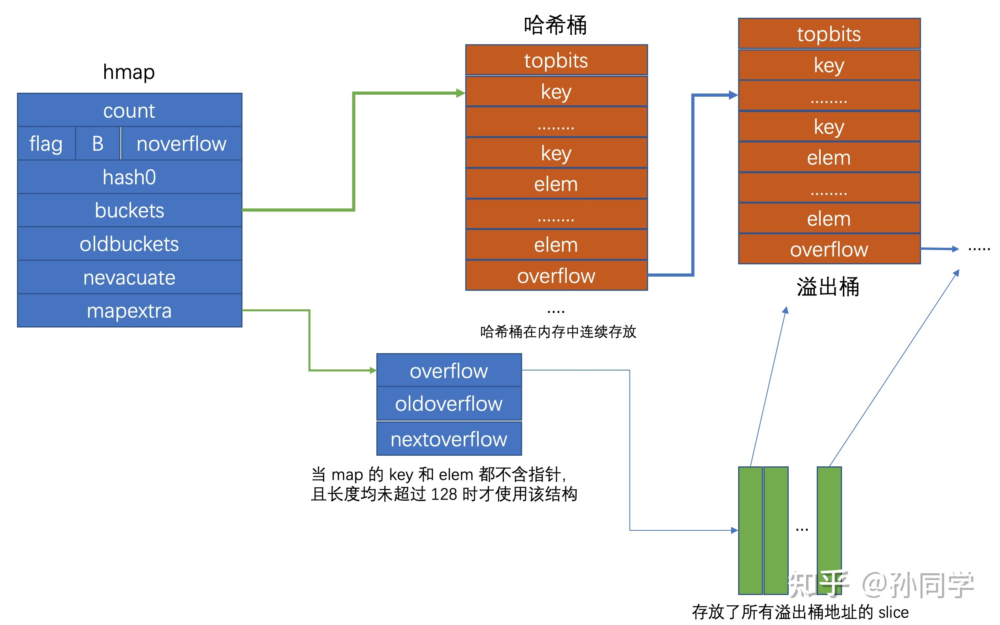

## Go 语言 map 的底层实现完整剖析
Go 语言内置了 map 数据结构, map 的底层便是一个 HashTable, Go 语言的 map 的使用非常简易, 但其内部实现相对比较复杂, 
Go 语言的 Runtime 使用了多个数据结构来实现 HashTable, 本文完整剖析 Golang 对于 HashTable 的底层实现
 
### Go map 的底层结构
Go map 在语言底层是通过如下的抽象结构来表征, 其位置在 go/src/cmd/compile/internal/types/type.go
    
```go
// Map contains Type fields specific to maps.
    type Map struct {
        Key  *Type // Key type
        Elem *Type // Val (elem) type
    
        Bucket *Type // internal struct type representing a hash bucket
        Hmap   *Type // internal struct type representing the Hmap (map header object)
        Hiter  *Type // internal struct type representing hash iterator state
    }
```

前两个字段分别为 key value, 由于 go map 支持多种数据类型, go 会在编译期推断其具体的数据类型, Bucket 是哈希桶, 
Hmap 表征了 map 底层使用的 HashTable 的元信息, 如当前 HashTable 中含有的元素数据、桶指针等, 
Hiter 是用于遍历 go map 的数据结构, 将在下文中讨论

Hmap 的具体化数据结构位于 src/runtime/map.go 中, hmap 结构描述了 Go map 的关键信息
```go
// A header for a Go map.
type hmap struct {
    // Note: the format of the hmap is also encoded in cmd/compile/internal/gc/reflect.go.
    // Make sure this stays in sync with the compiler's definition.
    count     int // # live cells == size of map.  Must be first (used by len() builtin)
    flags     uint8
    B         uint8  // log_2 of # of buckets (can hold up to loadFactor * 2^B items)
    noverflow uint16 // approximate number of overflow buckets; see incrnoverflow for details
    hash0     uint32 // hash seed

    buckets    unsafe.Pointer // array of 2^B Buckets. may be nil if count==0.
    oldbuckets unsafe.Pointer // previous bucket array of half the size, non-nil only when growing
    nevacuate  uintptr        // progress counter for evacuation (buckets less than this have been evacuated)

    extra *mapextra // optional fields
}
```    
    其中 count 字段表征了 map 目前的元素数目, 当使用 len() 函数获取 map 长度时, 返回的便是 count 成员的值, 
    因此 len() 函数作用于 map 结构时, 其时间复杂度为 O(1), 
    
    flag 字段标志 map 的状态, 如 map 当前正在被遍历或正在被写入
    
    B 是哈希桶数目以 2 为底的对数, 在 go map 中, 哈希桶的数目都是 2 的整数次幂(这样设计的好处是可以是用位运算来计算取余运算的值, 
    即 N mod M = N & (M-1))
    
    noverflow 是溢出桶的数目, 这个数值不是恒定精确的, 当其 B>=16 时为近似值
     
    hash0是随机哈希种子, map创建时调用 fastrand 函数生成的随机数, 设置的目的是为了降低哈希冲突的概率, 
    
    buckets 是指向当前哈希桶的指针
    oldbuckets 是当桶扩容时指向旧桶的指针
    nevacuate 是当桶进行调整时指示的搬迁进度 小于此地址的 buckets 是以前搬迁完毕的哈希桶, 而 mapextra 则是表征溢出桶的变量

在讨论 mapextra 结构之前我们先来看 bmap, 即哈希桶的结构, 由于 go map 的 key 和 elem 可以有多种数据类型, 
因此哈希桶的数据类型也会随着 key 和 elem 数据类型的不同而不同, 具体的数据类型是在编译期确定的, 
因此 bmap 在 go 的源码中没有显式定义出来, 对 bmap 的操作也是通过计算地址偏移量来实现的, 

具体的函数位于 src/cmd/compile/internal/gc/reflect.go, 通过该函数我们也可以还原出 bmap 的结构
```go
type bmap struct {
    topbits  [8]uint8
    keys     [8]keytype
    elems    [8]elemtype
    //pad      uintptr(新的 go 版本已经移除了该字段, 我未具体了解此处的 change detail, 之前设置该字段是为了在 nacl/amd64p32 上的内存对齐)
    overflow uintptr
}
```
bmap 表征了 go map 哈希桶的结构, 其中 topbits 是键哈希值的高 8 位, keys 存放了哈希桶中所有键, elems 存放了哈希桶中的所有值,
overflow 是一个 uintptr 类型指针, 存放了所指向的溢出桶的地址, go map 的每个哈希桶最多存放 8 个键值对, 
当经由哈希函数映射到该地址的元素数超过 8 个时, 会将新的元素放到溢出桶中, 并使用 overflow 指针链向这个溢出桶, 
这里有一个需要注意的点是在哈希桶中, 键值之间并不是相邻排列的, 这是为了保证内存对齐

现在来看 mapextra 结构, 其数据结构定义为
```go
// mapextra holds fields that are not present on all maps.
type mapextra struct {
    // If both key and elem do not contain pointers and are inline, then we mark bucket
    // type as containing no pointers. This avoids scanning such maps.
    // However, bmap.overflow is a pointer. In order to keep overflow buckets
    // alive, we store pointers to all overflow buckets in hmap.extra.overflow and hmap.extra.oldoverflow.
    // overflow and oldoverflow are only used if key and elem do not contain pointers.
    // overflow contains overflow buckets for hmap.buckets.
    // oldoverflow contains overflow buckets for hmap.oldbuckets.
    // The indirection allows to store a pointer to the slice in hiter.
    overflow    *[]*bmap
    oldoverflow *[]*bmap

    // nextOverflow holds a pointer to a free overflow bucket.
    nextOverflow *bmap
}
```

当一个 map 的 key 和 elem 都不含指针并且他们的长度都没有超过 128 时(当 key 或 value 的长度超过 128 时, go 在 map 中会使用指针存储), 该 map 的 bucket 类型会被标注为不含有指针, 这样 gc 不会扫描该 map, 这会导致一个问题, bucket 的底层结构 bmap 中含有一个指向溢出桶的指针(uintptr类型, uintptr指针指向的内存不保证不会被 gc free 掉), 当 gc 不扫描该结构时, 该指针指向的内存会被 gc free 掉, 因此在 hmap 结构中增加了 mapextra 字段, 其中 overflow 是一个指向保存了所有 hmap.buckets 的溢出桶地址的 slice 的指针, 相对应的 oldoverflow 是指向保存了所有 hmap.oldbuckets 的溢出桶地址的 slice 的指针, 只有当 map 的 key 和 elem 都不含指针时这两个字段才有效, 因为这两个字段设置的目的就是避免当 map 被 gc 跳过扫描带来的引用内存被 free 的问题, 当 map 的 key 和 elem 含有指针时, gc 会扫描 map, 从而也会获知 bmap 中指针指向的内存是被引用的, 因此不会释放对应的内存



### 2. Go map 的查找
当要根据 key 从 map 中查询对应的 elem 时, 在 go 有两种写法, 一种是直接取值, 例如我们定义 hash := make(map[int]int), 则可以使用 s := hash[key], 也可以使用 s, ok := hash[key], 第一种写法无论 key 是否存在于 map 中, s 都会获取一个返回值, 而当 key 不存在时会返回对应类型的零值, 而第二种写法中, ok 变量可以标识此次是否从 map 中真正的获取到了 key 所对应的 elem, 在 go 语言底层, 这两种写法实际会调用两个不同函数, 它们都位于 src/runtime/map.go 中, 分别调用 mapaccess1 和 mapaccess2 函数, 这两个函数的内部逻辑几乎是一样的, 第二个相比于第一个仅仅多了一个是否查询到的标志位, 我们只来分析 mapaccess1 函数即可, go map 中使用了 aes 和 memhash 两类哈希, 当运行架构支持 aes 哈希时会优先使用 aes 作为 HashFunc, 具体的判定逻辑在 src/runtime/alg.go 的 alginit() 函数中, 当要 map 中查询一个元素时, go 首先使用 key 和哈希表的 hash0, 即创建 map 时生成的随机数做哈希函数运算得到哈希值, hmap 中的 B 表征了当前哈希表中的哈希桶数量, 哈希桶数量等于 2B2B, 这里 go 使用了我们在第一节提到的除留余数法来计算得到相应的哈希桶, 因为桶的数量是 2 的整数次幂, 因此这里的取余运算可以使用位运算来替代, 将哈希值与桶长度减一做按位与即得到了对应的桶编号, 当前这里的桶编号是一个逻辑编号, hmap 结构中存储了哈希桶的内存地址, 在这个地址的基础上偏移桶编号*桶长度便得到了对应的哈希桶的地址, 接下来进一步在该哈希桶中找寻 key 对应的元素, 比较的时候基于哈希值的高 8 位与桶中的 topbits 依次比较, 若相等便可以根据 topbits 所在的相对位置计算出 key 所在的相对位置, 进一步比较 key 是否相等, 若 key 相等则此次查找过程结束, 返回对应位置上 elem, 若 key 不相等, 则继续往下比较 topbits, 若当前桶中的所有 topbits 均与此次要找到的元素的 key 的哈希值的高 8 位不相等, 则继续沿着 overflow 向后探查溢出桶, 重复刚刚的过程, 直到找到对应的 elem, 或遍历完所有的溢出桶仍未找到目标元素, 此时返回该类型的零值

### 3. Go map 的插入/更新
go map 的插入和 go map 的查找过程类似, 在底层是调用 src/runtime/map.go#mapassign 函数实现的, 插入的具体过程是首先根据 key 和哈希表的 hash0 采用哈希算法(aes/memhash)获得哈希值, 然后使用哈希值与哈希桶数目使用位运算取余获得哈希桶编号, 接下来依次遍历哈希桶中的 topbits 与此次计算的哈希值的高 8 位进行对比, 若遍历到的 topbits 为空, 则临时记录下该位置, 然后继续向后遍历, 整个遍历的优先查找该 key 在 map 中是否存在, 若找到哈希值的高 8 位与哈希桶的 topbits 相等则进一步比较对应位置的 key, 若 key 也相等, 则此时更新该 key 对应的 elem, 在源码中当更新完成后使用 goto 语句直接跳转到函数最后, 更新 hmap 的标志位, 移除正在写入的标识并返回 elem 对应的指针, 在 go map 写入的过程中, 若当前哈希桶未找到 topbits 与哈希值高 8 位相等的, 则沿着 overflow 继续向后遍历溢出桶, 当遍历到最后, 如果没有找到相等的 key, 若遍历的过程中找到空位, 则将新建的 k/v 插入到该空位上, 否则意味着当前的所有哈希桶包括溢出桶在内都已经存满元素了, 此时要判定是否进行 HashTable 的扩容, HashTable 若要扩容需要满足一定条件, 如当前没有正在扩容并且 HashTable 的装载因子已经超过 6.5 了, 或者当前的溢出桶数目过多时会触发 HashTable 的扩容, 当 HashTable 扩容完毕后, 写入操作会 goto 到一开始, 重复上述过程, 反过来, 若当前没有达到 HashTable 扩容的条件, 则此时只是简单地再生成一个溢出桶, 然后将 key 和 elem 放入新的溢出桶的第一个位置上, 完成此次的写入操作

### 4. Go map 的删除
go map 的删除与查找/插入/更新操作的过程类似, 都是通过哈希映射、比较 topbits、依次遍历哈希桶溢出桶、计算 key/elem 偏移量等过程来定位元素位置, 当找到元素后, 则清空的对应的内存位置的数据, 有的元素是以指针形式存储的(如长度超过 128 的 key/elem), 则定位到该指针对应的内存将数据清空

### 5. Go map 的扩容
随着向 HashTable 中插入的元素越来越多, 哈希桶的 cell 逐渐被填满, 溢出桶的数量可能也越来越多, 此时哈希冲突发生的频率越来越高, HashTable 的性能将不断下降, 为了解决这个问题, 此时需要对 HashTable 做扩容操作, 对于任意一个 HashTable 来说, 装载因子表征了此时 HashTable 中存放元素的状况, 其一般的定义为

    LOADFACTOR = Element.length/HashTable.length
在 go map 中, 针对 go map 的特定数据结构, 其装载因子等于 k/v 对数目除以哈希桶的数目(含溢出桶), golang 规定当该定义下的装载因子达到 6.5 时便需要触发 map 的扩容, go map 扩容和策略共有两种, 除了刚刚所说的装载因子达到 6.5 之外, 若溢出桶过多也会触发 map 的扩容, 这是基于这样的考虑, 向 map 中插入大量的元素, 哈希桶将逐渐被填满, 这个过程中也可能创建了一些溢出桶, 但此时装载因子并没有超过设定的阈值, 然后对这些 map 做删除操作, 删除元素之后, map 中的元素数目变少, 使得装载因子降低, 而后又重复上述的过程, 最终使得整体的装载因子不大, 但整个 map 中存在了大量的溢出桶, 因此当溢出桶数目过多时, 即便没有达到装载因子 6.5 的阈值也会触发扩容, 若装载因子过大, 说明此时 map 中元素数目过多, 此时 go map 的扩容策略为将 hmap 中的 B 增一, 即将整个哈希桶数目扩充为原来的两倍大小, 而当因为溢出桶数目过多导致扩容时, 因此时装载因子并没有超过 6.5, 这意味着 map 中的元素数目并不是很多, 因此这时的扩容策略是等量扩容, 即新建完全等量的哈希桶, 然后将原哈希桶的所有元素搬迁到新的哈希桶中

分析 go map 的插入和删除函数的源码可知, map 的扩容是发生在插入和删除的过程中, 扩容的具体逻辑位于 src/runtime/map.go#growWork, go map 的扩容类似于 redis, 都是采用渐进式扩容, 避免一次性对大 map 扩容造成的区间性能抖动, go 扩容的基本步骤是首先根据扩容条件(装载因子 >= 6.5 或 溢出桶数目太多), 而确定扩容后的大小, 然后创建该大小的新哈希桶, 这时会将 hmap 中的 buckets 指针指向新创建的哈希桶, 而原先的哈希桶地址则保存在 oldbuckets 指针中, 该段逻辑位于 src/runtime/map/go#hashGrow, 该函数只是用于为新的哈希桶创建存储空间, 并未开始搬迁, 具体的搬迁逻辑位于 src/runtime/map.go#evacuate 中, 若是因为溢出桶数目过多造成的扩容, 则扩容是等量扩容, 整个过程是将原 Bucket 中的所有元素迁移到新的等量的 Bucket 中, 在迁移的过程中, 哈希桶(非溢出桶)的相对位置不会发生改变, 即原先位于 N 号 Bucket 的元素会映射到新的 N 号 Bucket 位置上, 而若是翻倍扩容, 则元素会被平均(此处不是数学意义上的严格平均, 其具体分流逻辑是用哈希值与原 Bucket 数目做逻辑与运算, 取决于 HashFunc 的该位是否足够平均)分流到两段上, 在 go 中每次只搬迁两个 Bucket, 当所有元素都搬迁完毕之后, hmap 的 oldbuckets 指针会被设置为 nil, 因此 oldbuckets 指针是否为 nil 可以作为当前 map 是否处于扩容状态的一个标志

### 6. Go map 的遍历
go map 的遍历原本是一件比较简单的事情, 外层循环遍历所有 Bucket, 中层循环横向遍历所有溢出桶, 内层循环遍历 Bucket 的所有 k/v , 若没有扩容逻辑的话, 以上所述的 3 层循环即可完成 map 的遍历, 但由于扩容逻辑的存在, 使得 map 遍历复杂性略微有所增加, map 的迭代器由如下结构来表征

```go
// A hash iteration structure.
// If you modify hiter, also change cmd/compile/internal/gc/reflect.go to indicate
// the layout of this structure.
type hiter struct {
    key         unsafe.Pointer // Must be in first position.  Write nil to indicate iteration end (see cmd/internal/gc/range.go).
    elem        unsafe.Pointer // Must be in second position (see cmd/internal/gc/range.go).
    t           *maptype
    h           *hmap
    buckets     unsafe.Pointer // bucket ptr at hash_iter initialization time
    bptr        *bmap          // current bucket
    overflow    *[]*bmap       // keeps overflow buckets of hmap.buckets alive
    oldoverflow *[]*bmap       // keeps overflow buckets of hmap.oldbuckets alive
    startBucket uintptr        // bucket iteration started at
    offset      uint8          // intra-bucket offset to start from during iteration (should be big enough to hold bucketCnt-1)
    wrapped     bool           // already wrapped around from end of bucket array to beginning
    B           uint8
    i           uint8
    bucket      uintptr
    checkBucket uintptr
}
```
其中 src/runtime/map.go#mapiterinit 函数来初始化以上结构体, 然后调用 src/runtime/map.go#mapiternext 来实现具体的遍历逻辑, 由于 map 扩容逻辑的存在, map 的遍历是无序的, 而实际上即便我们在代码中硬编码一个固定的 map, 其所有的 k/v 都以常数写在源码中, 也不对其做插入/删除/更新操作, 其每次遍历的结果仍然是不同的, 这是因为 go 随机设置了遍历起点, 不仅起始 Bucket 是随机的, 对于 Bucket 中的起始 cell 也是随机的(这样做似乎是为了规避程序员故意使用这个 map 的顺序?), map 在迭代过程中, 需要检查 map 的状态, 如果 map 当前正处于扩容状态, 则需要检查遍历到的 Bucket, 若 Bucket 尚未搬迁, 则需要去该 Bucket 对应的 oldBucket 里遍历元素, 并且这里要注意因为 oldBucket 中的元素可能会分流到两个新 Bucket 中, 因此在遍历时只会取出会分流到当前 Bucket 的元素, 否则元素会被遍历两次, 具体细节可以看 mapiternext 函数的代码